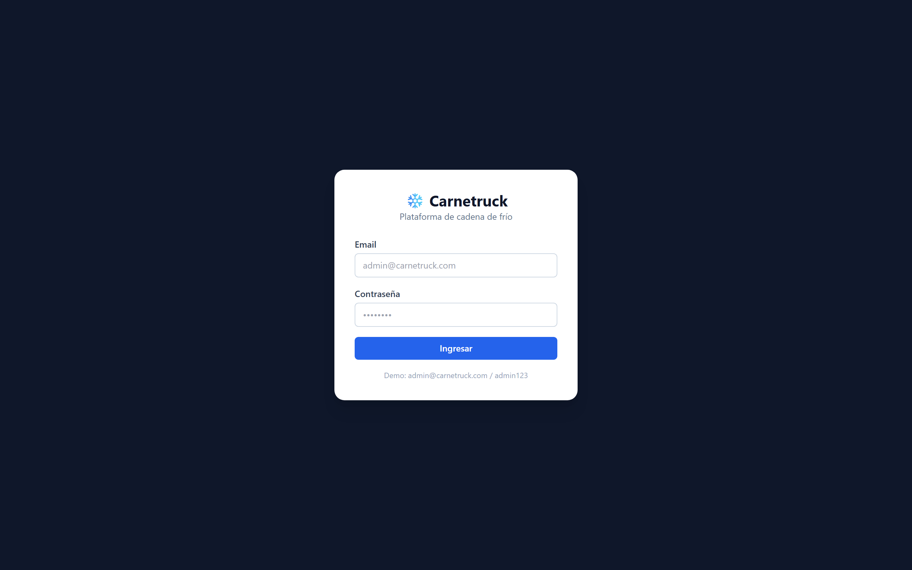
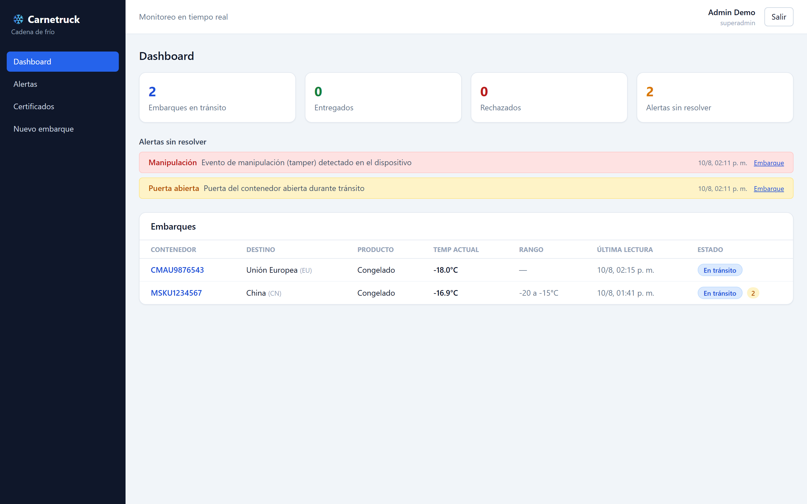
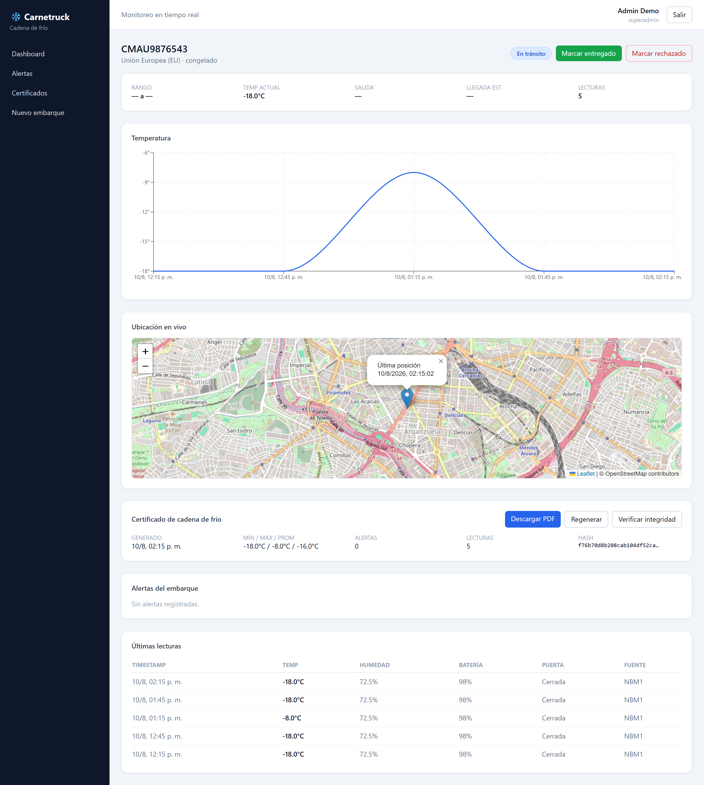
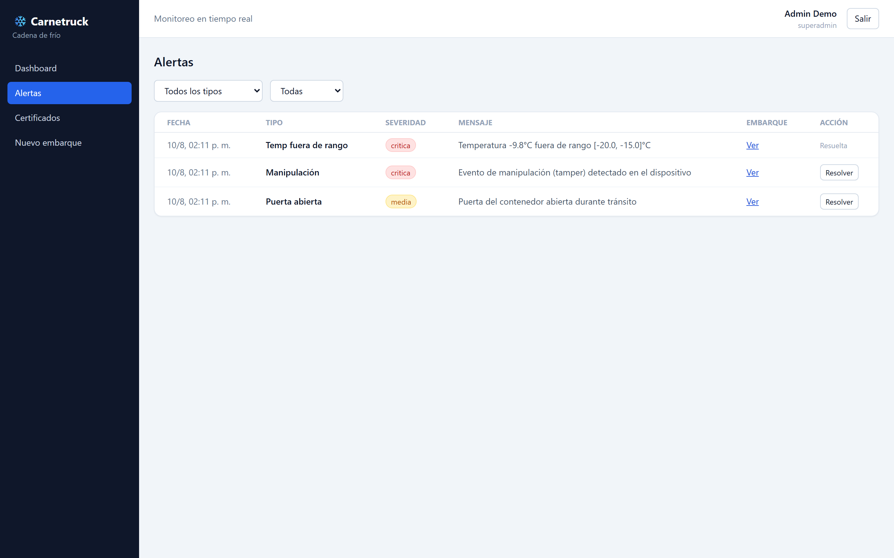
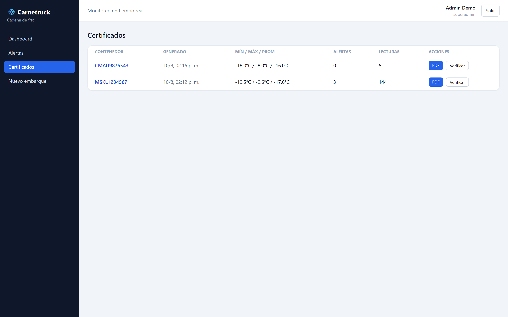
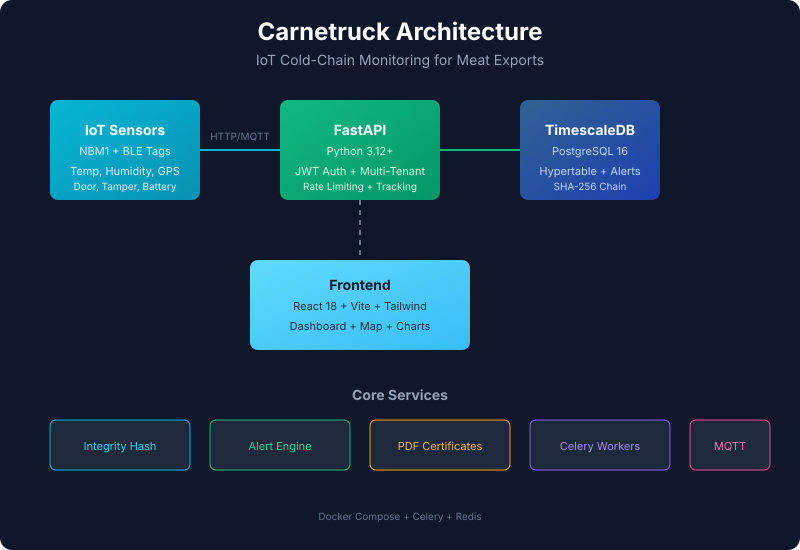

# Carnetruck ❄️ — Monitoreo IoT de cadena de frío para exportación cárnica

[](https://github.com/Fernandezalejo1/carnetruck/actions/workflows/ci.yml)
[](https://opensource.org/licenses/MIT)
[](https://www.python.org/downloads/)
[](https://fastapi.tiangolo.com/)
[](https://github.com/Fernandezalejo1/carnetruck/tree/main/backend/tests)
[](https://docs.docker.com/compose/)
[](https://www.timescale.com/)

---

Plataforma que recibe datos en tiempo real de sensores IoT instalados en contenedores cárnicos (temperatura, humedad, ubicación, apertura de puerta, tamper), los almacena de forma **inmutable y auditable** (hash SHA-256 encadenado por lectura), dispara **alertas** ante desvíos y genera **certificados PDF** de cadena de frío para presentar ante aduanas e importadores (China GACC, UE, USDA-FSIS).

---

## Capturas de pantalla

> 📸 **Demo disponible**: Ejecutá `docker compose up -d --build` y abrí http://localhost:8080
> 
> Credenciales demo: `admin@carnetruck.com` / `admin123`

---

## Características

- **Ingesta dual de sensores**: NBM1 (LTE-M / NB-IoT) + tag BLE de temperatura de precisión (±0.3–0.5 °C), bajo el mismo `shipment_id`.
- **Integridad inmutable**: cada lectura encadena un hash SHA-256 sobre la anterior; alterar cualquier lectura invalida los certificados (tamper-evident).
- **Alertas en tiempo real**: temperatura fuera de rango, puerta abierta, tamper y batería baja, con notificación vía webhook (n8n → WhatsApp/email).
- **Certificados PDF regulatorios**: estadísticas min/max/prom, conteo de alertas, gráfico SVG y hash del documento sobre la cadena completa; endpoint `verify` que recomputa la integridad.
- **Multi-tenant**: cada frigorífico/exportador aislado con su propio JWT; device keys por sensor.
- **Modo alertas sin infraestructura**: `ALERT_EVAL_MODE=sync` evalúa inline (cero infra para arrancar) o con Celery + Redis + beat.

## 📸 Capturas de pantalla







## Arquitectura



### Flujo de datos

1. El sensor envía la lectura (cada 5–30 min) → `POST /api/v1/ingest` (o MQTT → ingestor).
2. La API valida, **deduplica** por `(shipment_id, timestamp)`, calcula el **hash encadenado** y guarda.
3. El motor de reglas evalúa contra el rango del embarque y crea alertas en caso de desvío.
4. El dashboard consulta por polling (30 s) y muestra gráfico + mapa en vivo.
5. Al finalizar el embarque se genera el **certificado**; el endpoint `verify` recomputa el hash desde la DB.

## Stack

| Capa | Tecnología |
|---|---|
| Backend | Python 3.12+, FastAPI, SQLAlchemy 2, Pydantic v2, Alembic |
| Datos | TimescaleDB (hypertable) · SQLite para desarrollo |
| Procesamiento | Celery + Redis (opcional; modo sync disponible) |
| Frontend | React 18 + Vite + Tailwind + Recharts + Leaflet |
| Documentos | WeasyPrint + generador PDF puro como fallback |

## Quickstart

### Opción A — Docker Compose (recomendada)

```bash
cp .env.example .env          # ajustar JWT_SECRET
docker compose up -d --build
# API:   http://localhost:8000/docs
# Front: http://localhost:8080
# (opcional) ingesta MQTT: docker compose --profile mqtt up -d
```

Con `SEED_DEMO=true` (default en compose) se crea un frigorífico demo con un embarque simulado de 3 días, alertas y lecturas reales.

### Opción B — Desarrollo local

```bash
# Backend (usa SQLite por defecto; WeasyPrint opcional)
cd backend
python3 -m venv .venv
source .venv/bin/activate          # Windows: .venv\Scripts\activate
pip install -r requirements.txt
DATABASE_URL=sqlite:///./carnetruck.db SEED_DEMO=true \
  uvicorn app.main:app --reload --port 8000

# Frontend
cd ../frontend
npm install
npm run dev                        # http://localhost:5173 (proxy /api → 8000)
```

### Credenciales demo

| Rol | Email | Password |
|---|---|---|
| Superadmin | `admin@carnetruck.com` | `admin123` |
| Operador | `operador@carnetruck.com` | `operador123` |

La `api_key` del device se ve en `GET /api/v1/devices` (o en el log del seed).

## Tests

```bash
cd backend
pytest -q          # 20 tests: hash chain, alert engine, ingesta API, aislamiento multi-tenant, certificados
```

## API principal

| Método | Ruta | Auth | Descripción |
|---|---|---|---|
| POST | `/api/v1/auth/login` | — | Login JWT |
| POST | `/api/v1/ingest` | `X-Device-Key` | Ingesta de lectura (NBM1 o BLE) |
| GET | `/api/v1/shipments` | JWT | Embarques del tenant (filtros por estado/mercado, paginado) |
| POST | `/api/v1/shipments` | JWT admin | Crear embarque / asignar sensor |
| GET | `/api/v1/shipments/{id}/readings` | JWT | Serie histórica (`from`, `to`, `limit`, `offset`) |
| GET | `/api/v1/shipments/{id}/alerts` | JWT | Alertas del embarque |
| POST | `/api/v1/shipments/{id}/alerts/{aid}/resolve` | JWT | Resolver alerta |
| POST | `/api/v1/shipments/{id}/finalizar` | JWT admin | Entregado/rechazado (genera certificado al entregar) |
| GET | `/api/v1/certificates/{id}/pdf` | JWT | Descargar certificado PDF |
| GET | `/api/v1/certificates/{id}/verify` | JWT | Verificar integridad del documento |
| GET | `/api/v1/devices` · `/api/v1/alerts` | JWT | Dispositivos y alertas globales del tenant |

Ejemplo de ingesta:

```bash
curl -X POST http://localhost:8000/api/v1/ingest \
  -H "X-Device-Key: <api_key_del_device>" \
  -H "Content-Type: application/json" \
  -d '{"timestamp":"2026-08-10T12:00:00Z","temperatura":-18.2,"humedad":71.0,
       "lat":-34.6,"lng":-58.4,"puerta_abierta":false,"tamper":false,
       "bateria":88.0,"fuente":"ble","shipment_id":1}'
```

## Integridad (hash encadenado)

- Cada lectura guarda `hash_actual = SHA256(hash_anterior | payload_canónico)`; la primera encadena sobre un valor génesis fijo. El payload canónico es JSON con claves ordenadas y timestamps normalizados a UTC (independiente de la base de datos).
- Un constraint `UNIQUE(shipment_id, timestamp)` + manejo de colisión hace la ingesta **idempotente**.
- El `hash_documento` del certificado cubre la cadena completa de lecturas + metadatos; alterar cualquier lectura invalida la verificación.

## Integración del sensor (NBM1 + tag BLE)

- Usar el **NBM1** para ubicación (GNSS), puerta, tamper y vibración.
- Sumar un **tag BLE de temperatura/humedad** (±0.3–0.5 °C) que el NBM1 reenvíe por NB-IoT; el payload distingue `fuente: "nbm1" | "ble"` bajo el mismo `shipment_id`.
- La ruta habitual es webhook HTTP: el SIM provider reenvía cada mensaje a `POST /api/v1/ingest`. La ruta MQTT (`docker compose --profile mqtt up`) publica en `carnetruck/{imei}/readings`.

## Estructura del proyecto

```
├── backend/                 # FastAPI (Python 3.12+, SQLAlchemy 2, Pydantic v2)
│   ├── app/
│   │   ├── api/             # auth, ingest, shipments, devices, certificates
│   │   ├── models/          # Tenant, User, Device, Shipment, Reading, Alert, Certificate
│   │   ├── services/        # integrity_hash, alert_engine, certificate_generator, notifier
│   │   ├── workers/         # Celery: evaluate_reading + check_missing_signal (beat)
│   │   └── seed.py          # datos demo (viaje simulado de 3 días)
│   ├── alembic/             # migraciones
│   └── tests/               # pytest (20 tests)
├── frontend/                # React 18 + Vite + Tailwind + Recharts + Leaflet
├── docker-compose.yml       # db (Timescale), redis, backend, worker, beat, frontend, [mqtt]
└── .env.example
```

## 🔒 Seguridad

- **JWT autenticación** — Tokens stateless con expiración configurable
- **Multi-tenant** — Aislamiento completo por frigorífico/exportador
- **Role-based access** — Admin, operador, viewer con permisos granulares
- **Device keys** — Cada sensor tiene su propia clave de API
- **Integridad inmutable** — SHA-256 encadenado por lectura (tamper-evident)
- **Rate limiting** — Protección contra abuso de API
- **Request tracking** — X-Request-Id para trazabilidad de peticiones
- **CORS restringido** — Orígenes configurados via variable de entorno

Ver [SECURITY.md](SECURITY.md) para reportar vulnerabilidades.

## 📚 API Documentation

La documentación Swagger está disponible en:

```
http://localhost:8000/docs
```

## 🤝 Contribuir

Ver [CONTRIBUTING.md](CONTRIBUTING.md) para guías de desarrollo.

## 🌐 Landing Page

El directorio `landing/` contiene una página de marketing one-page para el producto.
Ver `landing/index.html` para la landing completa con animaciones, FAQ y secciones de features.

## 🚀 Deploy

Ver [DEPLOY.md](DEPLOY.md) para guías de deploy (Docker, Railway, Render).
## Licencia

MIT © 2026 Alejo Fernandez — ver [LICENSE](LICENSE).
